# Páginas

Un recorrido visual por las principales pantallas de una Red Helpbuttons. Las capturas están tomadas de una red comunitaria real — "Vecinos del Campillín" — usada como ejemplo.

---

## Páginas de usuario

### Inicio

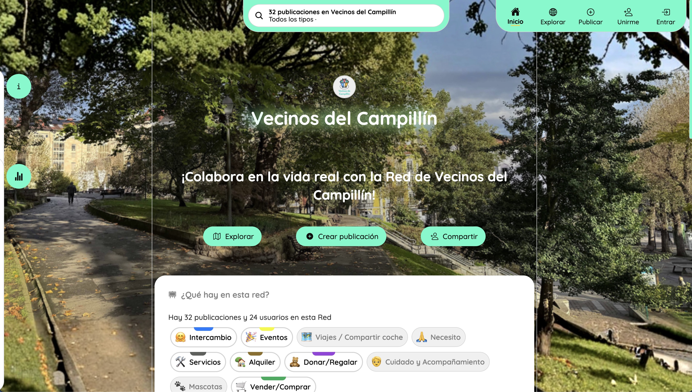

La parte superior de la página de inicio muestra el nombre de la red, el eslogan y la imagen de fondo — todo definido por el coordinador. Tres acciones principales siempre visibles: **Explorar**, **Crear publicación** y **Compartir**. Debajo del encabezado, una tarjeta resumen muestra cuántos botones y usuarios están activos, seguida de todos los tipos de botón disponibles como accesos rápidos.

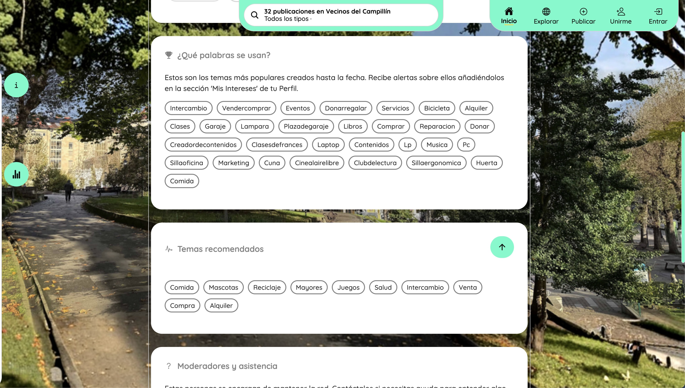

Bajando aparecen las etiquetas más usadas en la red (útil para descubrir qué temas están activos), la lista curada de etiquetas recomendadas por el coordinador, y una sección con los coordinadores y contactos de asistencia. Los visitantes nuevos usan esta página para entender de qué trata la comunidad antes de registrarse.

---

### Explorar

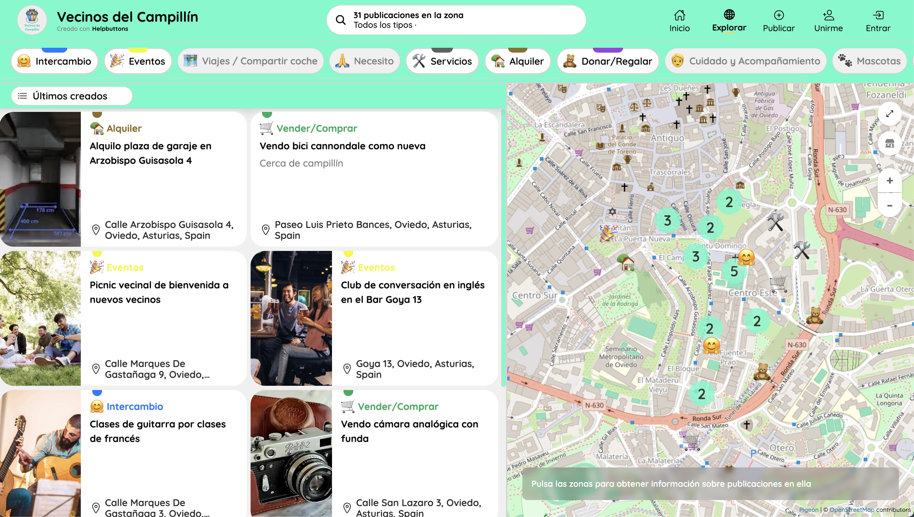

La vista principal de la Red. Los botones aparecen como pines en el mapa y como tarjetas resumen en una lista a su lado. Los filtros por tipo de botón están fijados arriba, permitiendo acotar rápidamente por categoría. Al hacer clic en una zona del mapa se expanden los botones de esa área. La URL codifica el estado del mapa, haciendo que cualquier vista sea compartible como enlace directo.

---

### Filtros

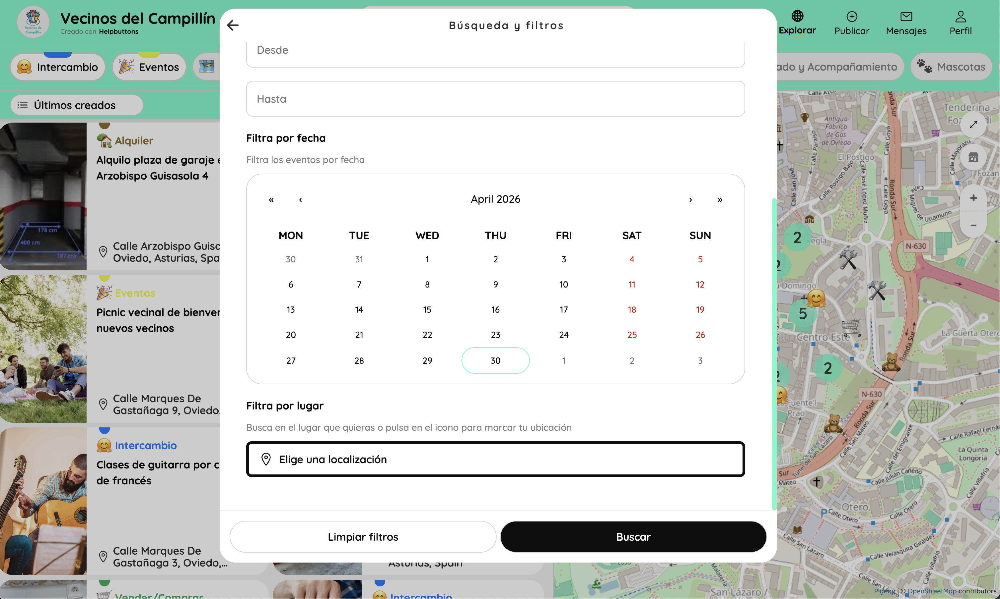

Un panel superpuesto accesible desde Explorar. Los usuarios pueden filtrar botones por rango de fechas (con selector de calendario), por lugar (búsqueda o soltar un pin), o combinar ambos. Los filtros se aplican simultáneamente al mapa y a la lista.

---

### Publicar un botón

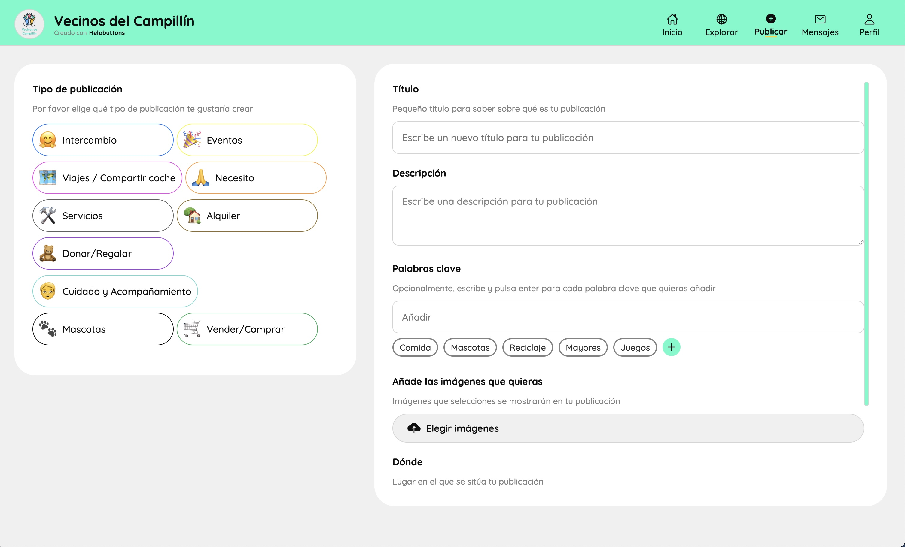

El formulario de creación de botones. A la izquierda, el usuario selecciona el tipo de botón — cada tipo tiene icono y color personalizados por el coordinador. A la derecha, los campos estándar: título, descripción, palabras clave (etiquetas), imágenes y ubicación. Si el tipo seleccionado tiene campos extra (fecha, precio, etc.) aparecen en este mismo formulario. El campo de ubicación abre un selector de mapa para colocación exacta o aproximada.

---

### Vista de botón

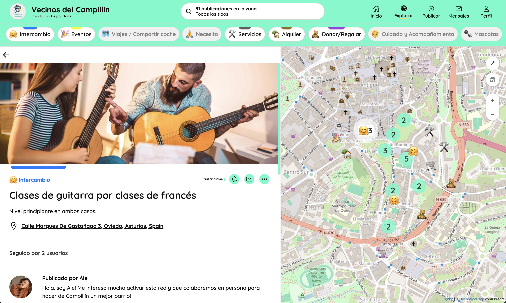

La página completa de un botón individual. Muestra la galería de imágenes, título, tipo, ubicación, número de seguidores y el primer mensaje del autor. El mapa permanece visible a la derecha, manteniendo el contexto geográfico. Los usuarios pueden seguir el botón para recibir actualizaciones, contactar al propietario o dejar comentarios públicos en el feed.

---

### Mensajes

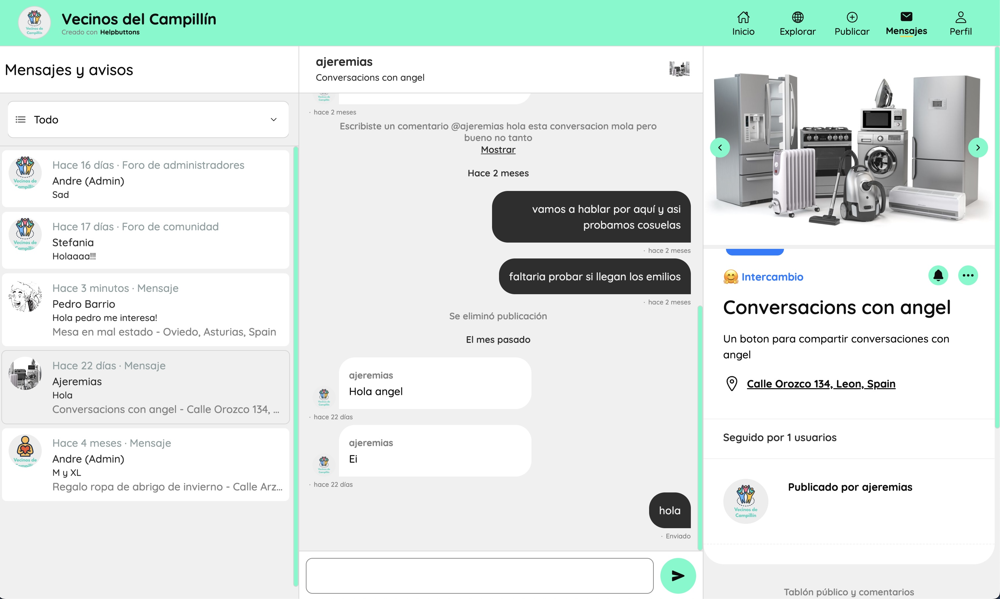

Vista de mensajería en tres paneles. La columna izquierda lista todas las conversaciones — mensajes privados directos, avisos del sistema, el foro comunitario y el foro de coordinadores. El centro muestra el hilo activo. El panel derecho muestra la tarjeta del botón cuando la conversación está vinculada a uno. Las conversaciones privadas entre usuarios están completamente separadas de los feeds de botones y solo son visibles para los dos participantes.

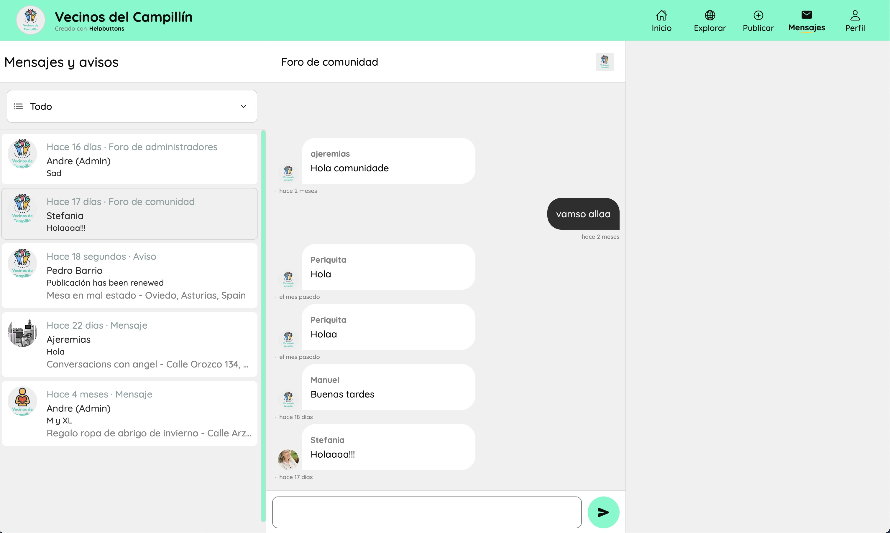

El hilo del **foro de comunidad** es un chat grupal compartido abierto a todos los miembros de la red, independiente de cualquier botón concreto. Útil para anuncios generales, preguntas y conversación comunitaria. El foro de coordinadores funciona igual pero está restringido a los coordinadores.

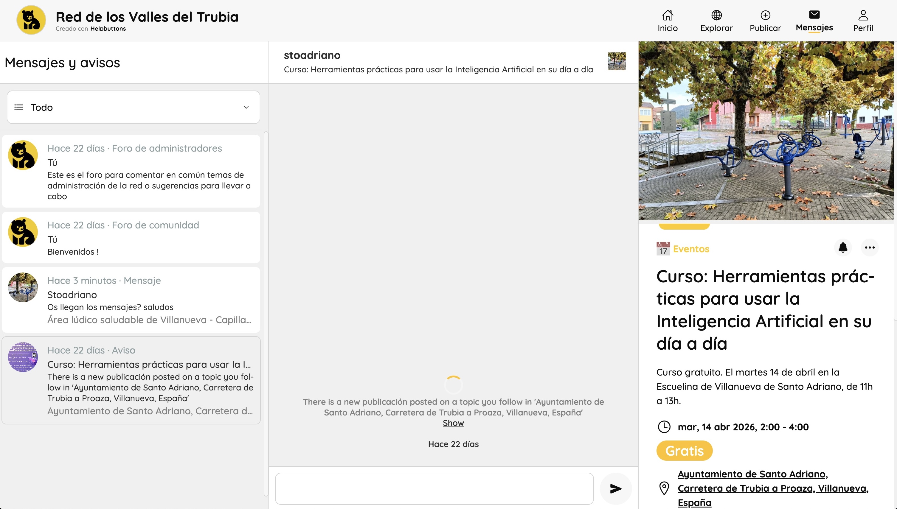

La bandeja de mensajes también muestra **avisos** del sistema — notificaciones automáticas como renovaciones de botones, suscripciones a etiquetas activadas o nuevos seguidores. Cuando un aviso está relacionado con un botón de evento, el panel derecho muestra la tarjeta completa del evento con fecha, hora, lugar y precio.

---

### Perfil

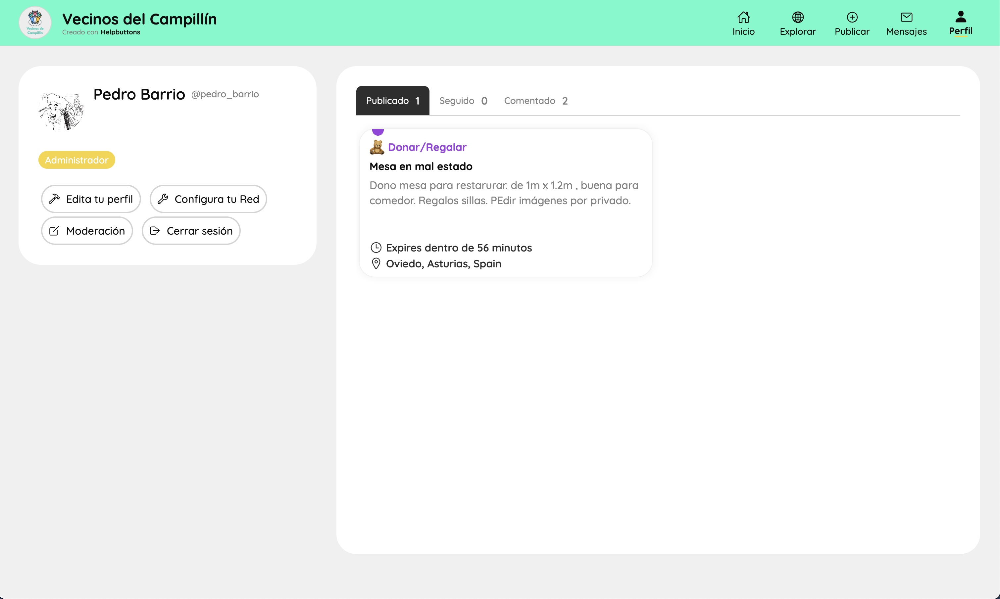

La página de perfil público del usuario. Muestra nombre, usuario, insignia de rol (ej. Coordinador) y pestañas con botones publicados, seguidos y comentados. Los coordinadores ven accesos directos para editar su perfil, configurar la Red, acceder a la moderación y cerrar sesión.

---

### Compartir e integración comunitaria

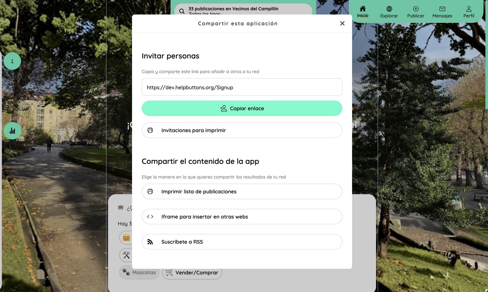

El panel de compartir, accesible desde la pantalla de inicio. Ofrece dos grupos de acciones:

**Invitar personas** — copiar el enlace de registro, o generar **invitaciones imprimibles con código QR** que la gente puede escanear para unirse a la red directamente, sin necesidad de conocer la URL.

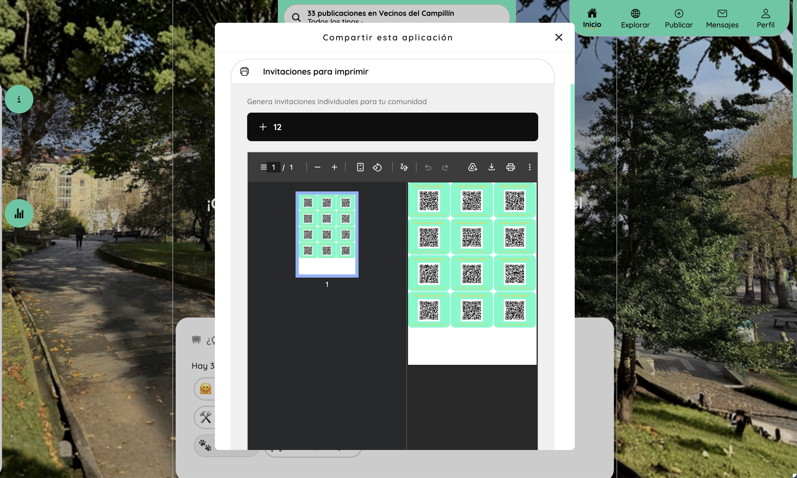

El generador de invitaciones produce una hoja PDF lista para imprimir con múltiples tarjetas QR por página — listas para recortar y repartir en eventos, tablones de anuncios o espacios comunitarios. Cada tarjeta es una credencial personal: escanear el QR permite al usuario acceder a la red directamente, sin necesidad de correo electrónico ni contraseña.

**Compartir contenido de la red** — imprimir la lista actual de botones como **boletín en PDF**, insertar la red en un sitio web externo mediante un **iframe**, o suscribirse al **feed RSS** de la red para seguir las nuevas publicaciones desde cualquier lector de feeds o herramienta de redes sociales.

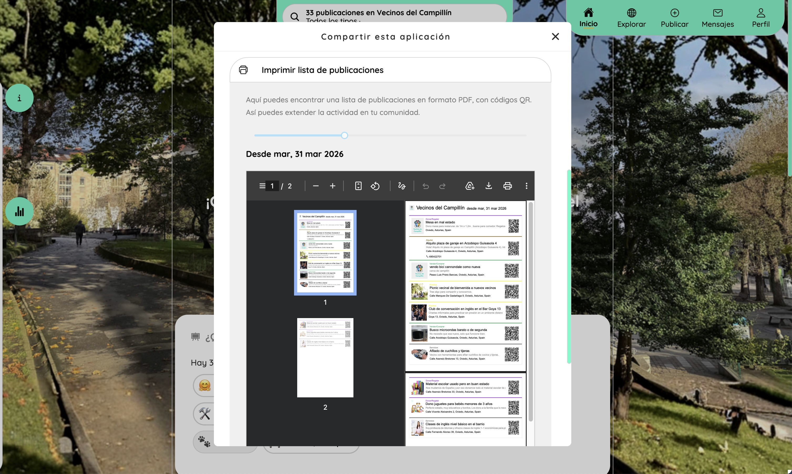

La exportación del boletín PDF genera un documento paginado con los botones actuales: título, tipo, descripción, ubicación y un código QR que enlaza a cada uno. Útil para imprimir y distribuir en espacios físicos — centros comunitarios, tablones de anuncios, asambleas — llegando a personas que no usan herramientas digitales.

---

### Preguntas frecuentes / Legal

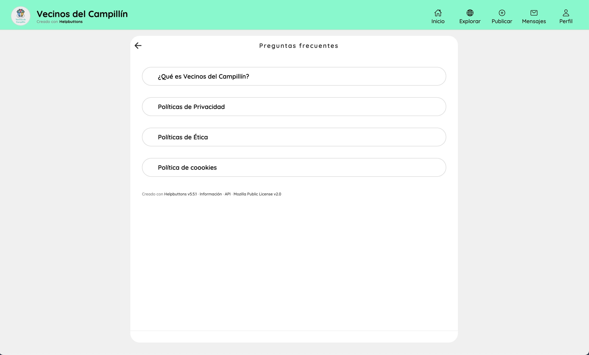

La página pública de preguntas frecuentes e información legal. Muestra la descripción de la red ("¿Qué es esta red?"), política de privacidad, política de ética y política de cookies — todo redactado por el coordinador en la configuración de la red. El pie de página muestra la versión de Helpbuttons y la Licencia Pública de Mozilla.

---

## Configuración de la Red (coordinador)

Todas las páginas de configuración se acceden desde Perfil → Configura tu Red. Los cambios tienen efecto inmediato.

---

### Resumen de configuración

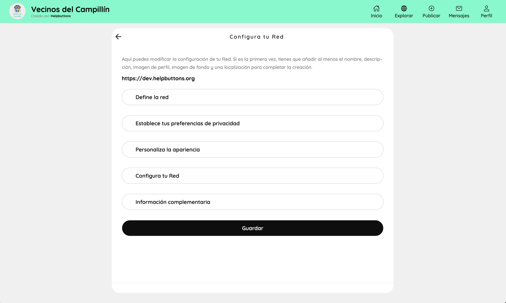

El panel de configuración principal. Todos los ajustes están agrupados en cinco secciones: **Define la red** (nombre, descripción, ubicación), **Preferencias de privacidad**, **Personaliza la apariencia**, **Configura tu Red** (ubicación, lugares destacados, etiquetas) e **Información complementaria** (textos legales, contacto). Un único botón Guardar al final aplica todos los cambios.

---

### Preferencias de privacidad

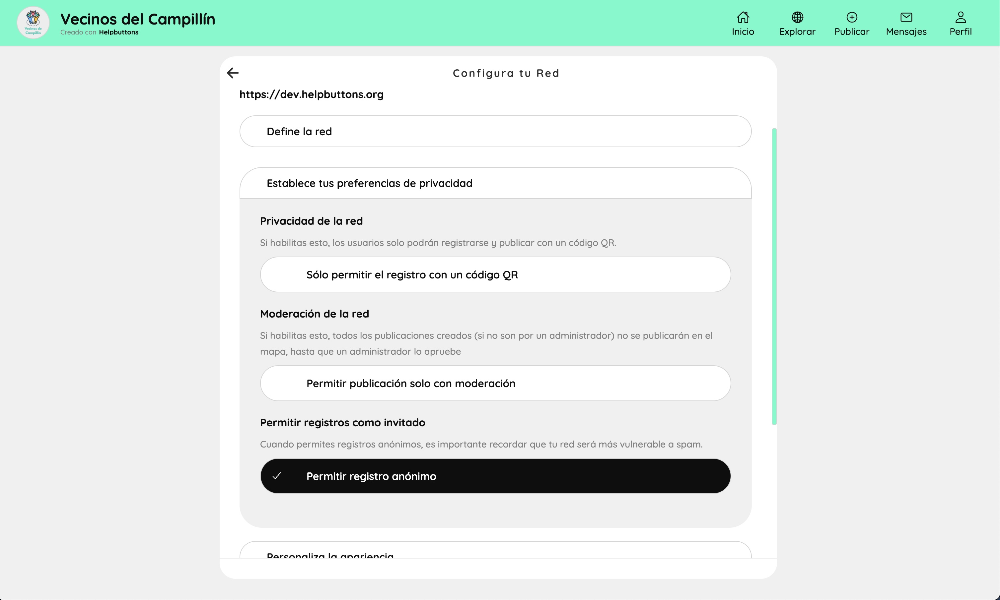

Controla tres políticas de acceso clave:

- **Registro solo con QR** — cuando está activado, los usuarios solo pueden registrarse escaneando una invitación QR; no hay registro abierto.
- **Moderación** — cuando está activado, todos los botones enviados por no-coordinadores quedan en espera hasta que un coordinador los apruebe antes de aparecer en el mapa.
- **Registro anónimo** — permite unirse sin correo electrónico, útil para herramientas comunitarias de bajo umbral (incluye advertencia de riesgo de spam).

---

### Apariencia

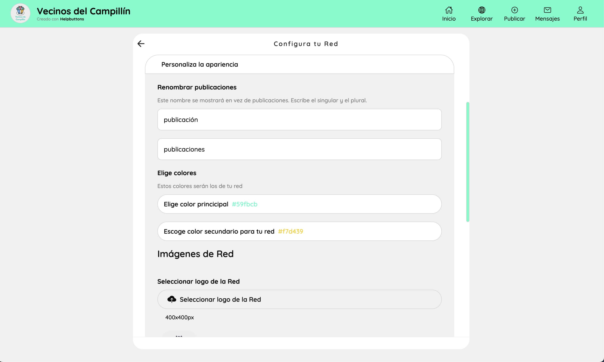

La identidad visual de la Red. Los coordinadores pueden renombrar cómo se llama un "botón" (singular y plural) para que la interfaz hable el idioma de la comunidad. Los colores principales y secundarios de marca se definen aquí (valores hex). El logo de la red (400×400 px) y la imagen de cabecera se suben en esta sección.

---

### Ubicación de la Red y lugares destacados

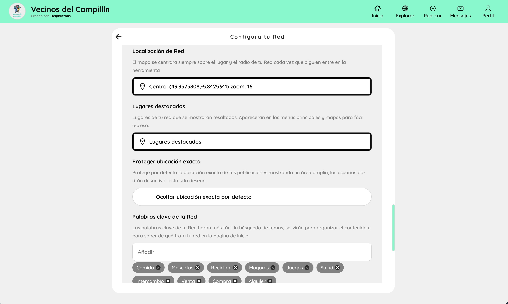

Establece el centro geográfico y el nivel de zoom predeterminado del mapa — es donde el mapa se sitúa cada vez que alguien abre la red. Los coordinadores pueden definir **lugares destacados** (puntos de referencia nombrados visibles como marcadores especiales en el mapa), activar u ocultar la ubicación exacta de los botones por defecto, y establecer las etiquetas recomendadas de la red que aparecen en la página de inicio.

---

### Selector de ubicación

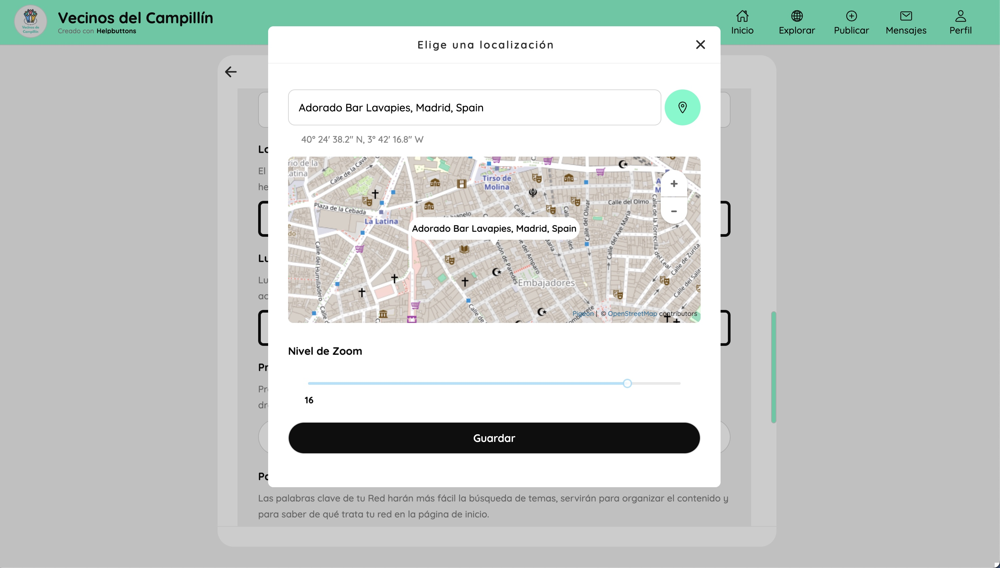

El modal selector de ubicación que se usa al establecer el centro de la red o al añadir un lugar destacado. Los coordinadores escriben una dirección o hacen clic en el mapa para colocar un pin, y ajustan el nivel de zoom predeterminado con un deslizador. Se usa tanto para la ubicación principal de la red como para cada lugar destacado individual.

---

### Lista de tipos de publicación

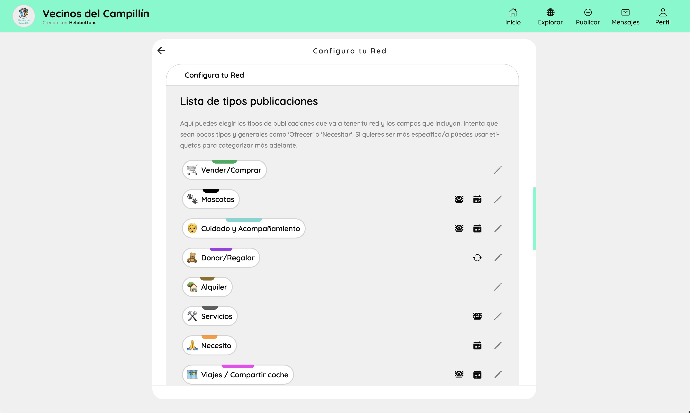

La lista de todos los tipos de botón definidos para esta Red. Cada tipo muestra su etiqueta, icono emoji y banda de color. Los iconos a la derecha indican si el tipo tiene campos extra (precio, fecha, programador). Los coordinadores pueden editar cualquier tipo o añadir nuevos.

---

### Editor de tipo de botón

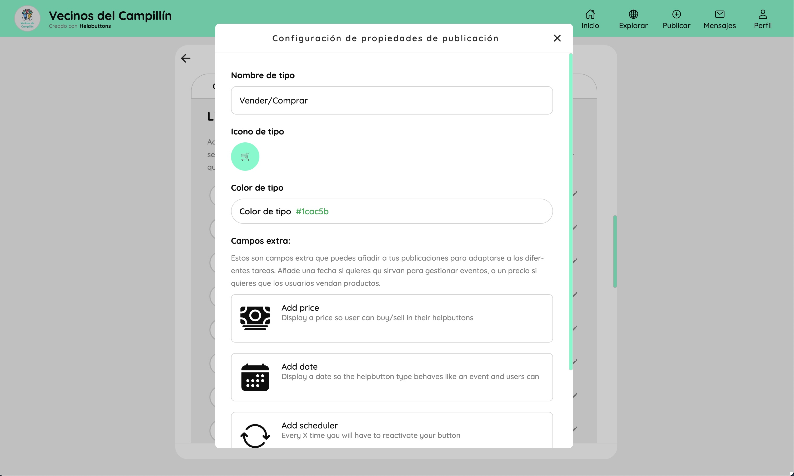

El editor para un tipo de botón individual. Los coordinadores definen el nombre del tipo, el icono (emoji) y el color. A continuación, se pueden activar campos extra opcionales: **Añadir precio** (activa la visualización de compra/venta), **Añadir fecha** (convierte el tipo en tipo de evento), **Añadir programador** (establece un recordatorio de reactivación automática). Estos campos extra aparecen en el formulario de publicación y como filtros en la página de Explorar.

---

### Información complementaria

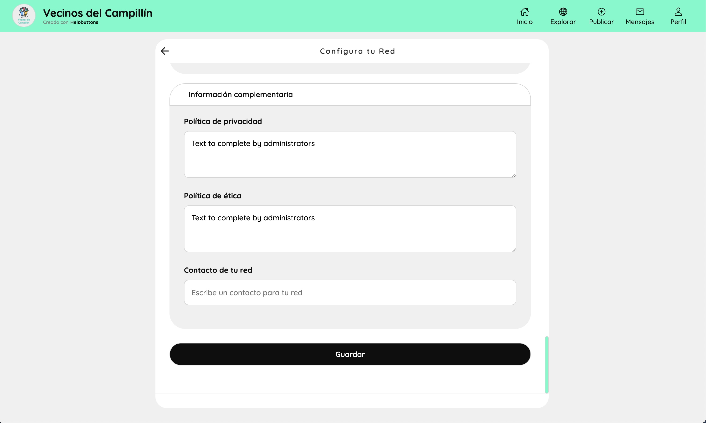

La sección legal y de contacto. Los coordinadores redactan la política de privacidad y la política de ética de la red en campos de texto libre. Estos textos se muestran públicamente en la página de preguntas frecuentes. Un campo de contacto permite publicar un correo o teléfono visible para todos los miembros.

---

## Moderación (coordinador)

### Panel de moderación

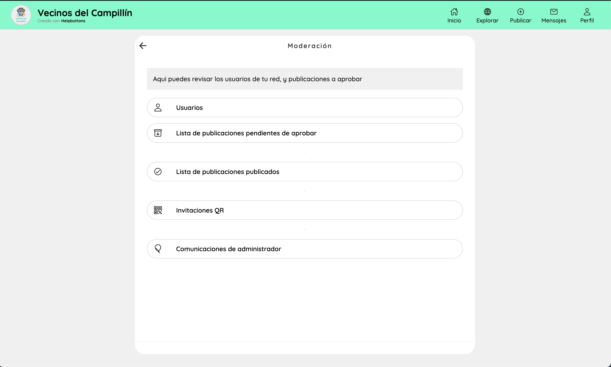

El centro de moderación, accesible desde la página de perfil. Secciones: **Usuarios** (gestionar cuentas, bloquear usuarios), **Publicaciones pendientes** (botones en espera de aprobación si el modo moderación está activo), **Publicaciones publicadas** (lista completa con búsqueda de todos los botones activos), **Invitaciones QR** (generar y gestionar códigos de invitación), **Comunicaciones de coordinador** (mensajes a toda la comunidad).

---

### Lista de moderación de botones

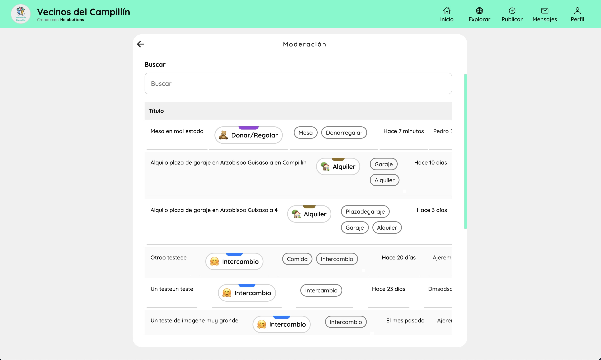

Una tabla con búsqueda de todos los botones publicados. Cada fila muestra el título, la insignia de tipo, las etiquetas, el tiempo desde la publicación y el autor. Los coordinadores pueden abrir cualquier botón desde aquí para revisarlo, editarlo o eliminarlo.

---

### Invitaciones QR

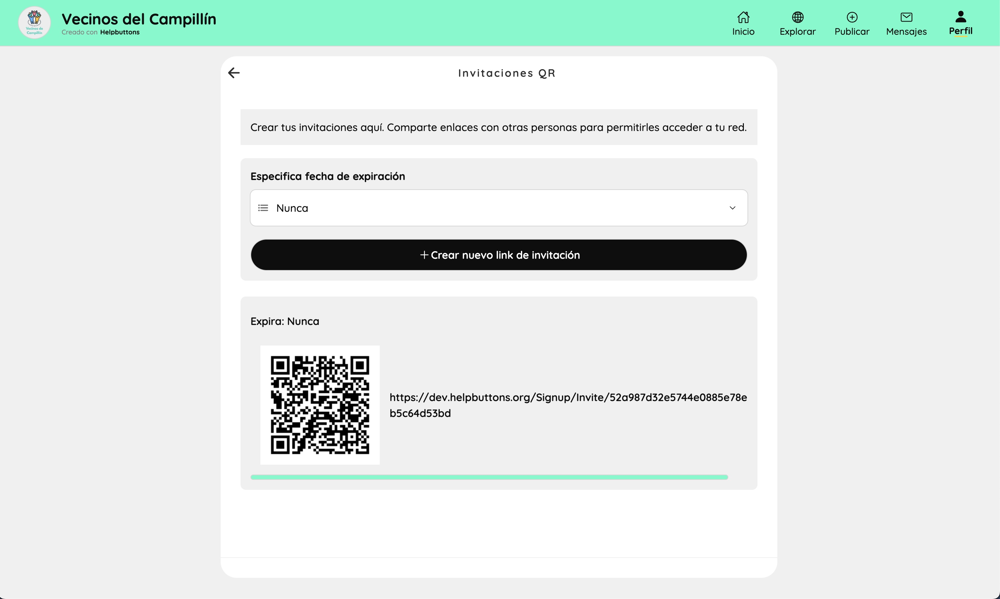

Genera tarjetas de invitación con fechas de expiración opcionales (día, semana, mes o nunca). Cada tarjeta se muestra como código QR y como URL de texto. El QR funciona como credencial personal — escanearlo permite al usuario acceder a la red directamente, sin necesidad de correo electrónico ni contraseña. Las tarjetas pueden imprimirse y distribuirse físicamente o compartirse de forma digital.
