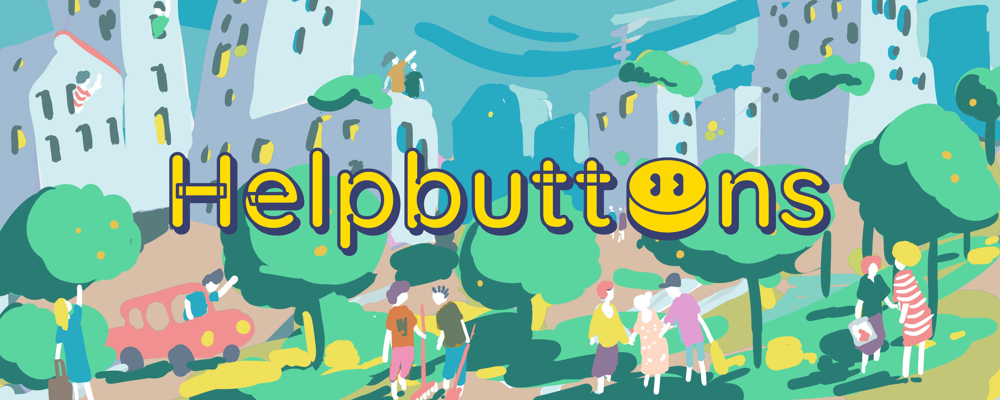

# What is Helpbuttons?

Helpbuttons is an open-source, self-hostable platform for building geo-based collaborative networks. It lets communities create their own cooperation tool — like mutual aid maps, resource sharing boards, or local exchange networks — hosted under their own control, adapted to their own needs.

Think of apps like Airbnb, BlaBlaCar, or food-sharing platforms. Helpbuttons gives any community the skeleton to build that kind of tool, without the corporate layer, the data harvesting, or the algorithmic agenda. You run it. You own it.

## Who is it for?

- **Mutual aid groups** coordinating support within a neighborhood or town
- **Community organizations** sharing resources, events, or skills
- **Schools and cooperatives** that need a private, focused network
- **Emergency teams** mapping needs and offers in a crisis
- **Town halls and local governments** building participatory tools for their territory
- **Anyone** who wants to build a collaboration app without starting from scratch

## How does it work?

Each Helpbuttons installation hosts one **Network**. A Network is a community space with its own name, location, configuration, and moderation. Inside a Network, people publish **Buttons** — geo-located posts that represent offers, needs, events, or any other type of interaction the community defines.

Users register, browse the map, filter by tags or type, contact each other via messages, and organize their cooperation in one shared space.

## Quick links

| | |
|---|---|
| **Main repository** | [github.com/helpbuttons/helpbuttons](https://github.com/helpbuttons/helpbuttons) |
| **Project home** | [helpbuttons.org](https://helpbuttons.org) |
| **Dev preview** | [dev.helpbuttons.org](https://dev.helpbuttons.org) |
| **Community chat** | [Telegram](https://t.me/+-_0KxKJ427VkYjU0) |
| **Contact** | [help@helpbuttons.org](mailto:help@helpbuttons.org) |

## Getting started

- **I want to install it** → [Installation Guide](5installation.md)
- **I want to understand the code** → [Architecture](6architecture.md) · [Core Concepts](concepts.md)
- **I want to contribute** → [Contributing Guide](contributing.md)
- **I want to understand the project values** → [Philosophy](2philosophy.md)
- **I want to grow a community with it** → [Spreading Helpbuttons](3buildCommunity.md)

## Project background

Helpbuttons is developed by a group of voluntary programmers. The project has been in development since 2012 through several prototypes. The current version is a mature, production-ready platform actively used in real communities.

If you want to support the project, you can donate or contribute code, translation, or documentation — see [Contact](15contact.md).
